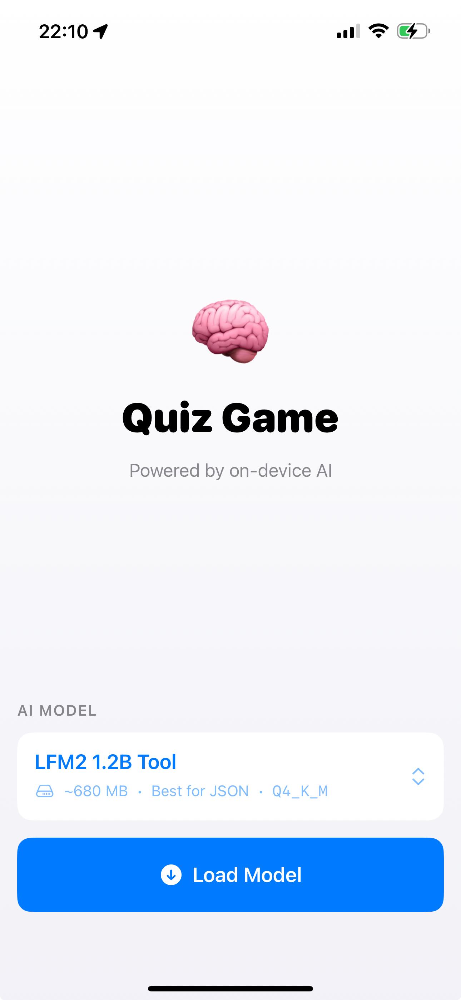
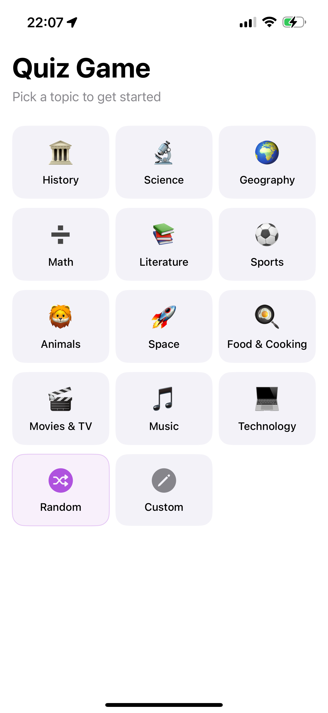
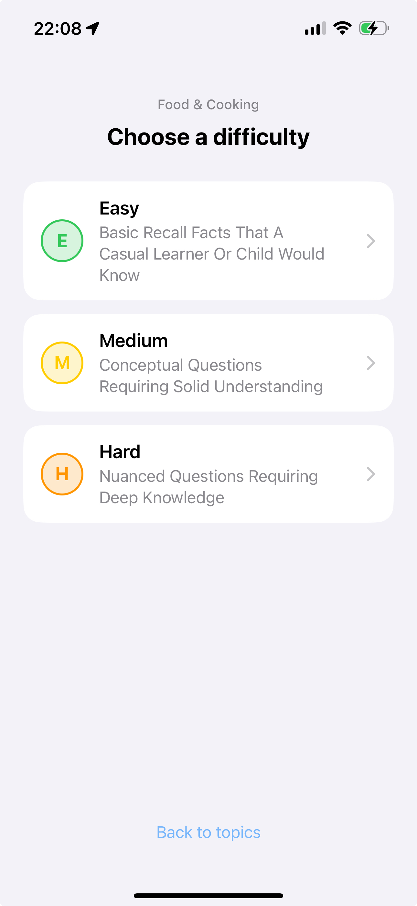
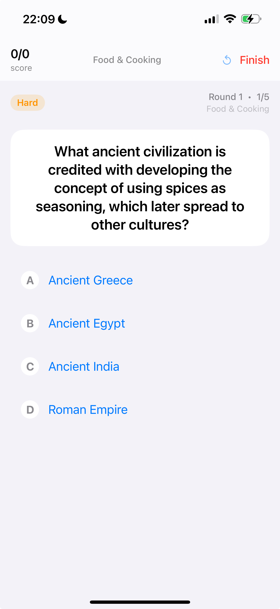
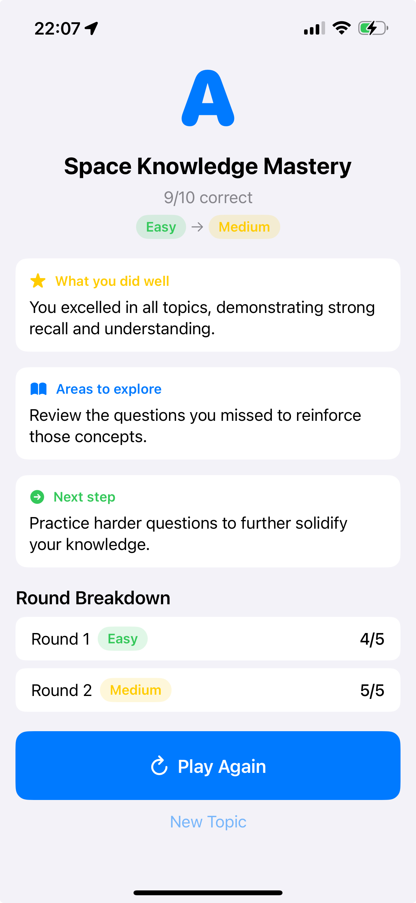

# BrainQuizLiquidLLM

An iOS quiz game powered entirely by an **on-device LLM** — no server, no internet required. Questions, answers, explanations, and performance summaries are all generated in real-time using [Liquid AI's LFM2 models](https://leap.liquid.ai) via the LeapSDK.

Built with Swift 6, SwiftUI, and Swift Concurrency.

---

## Demo

[](https://youtu.be/9bydWcidsTE)

---

## Screenshots

<p align="center">
  
  
  
  
  
</p>

---

## How It Works

The core challenge of building a quiz game on a small on-device model is avoiding **AI slop** (vague, repetitive, off-topic output) while keeping each LLM call small enough to fit within the model's effective context window. This is solved with a **3-phase stateless pipeline** — each call is minimal, focused, and independent.

### Phase 0 — Sub-category Generation
Asking the model to generate questions directly from a broad topic (e.g. "Space") causes repetition — across rounds it gravitates toward the same famous facts. Pre-generating 5 specific sub-areas solves this: each round is pinned to a different sub-category, so Phase 1 never receives the same prompt twice in a session.

Given a broad topic (e.g. "Space"), the model generates 5 specific sub-areas:
```
["Solar System", "Famous Astronauts", "Space Missions", "Stars & Galaxies", "Black Holes"]
```
Each round draws from one sub-category in sequence, guaranteeing distinct question sets across all 5 rounds.

### Phase 1 — Question List Generation
Generating questions and answers in a single call produces inconsistent output — the model tends to "lock in" on an answer style early and repeat it, or drift off-topic as the response grows. Separating them keeps each call small and focused.

Given a single sub-category and difficulty level, the model generates 5 trivia questions:
```
["What year did Voyager 1 launch?", "Who was the first human to walk on the Moon?", ...]
```
Questions are constrained to have a single short, definitive answer — recipe-style, how-to, and open-ended questions are explicitly prohibited in the prompt. The difficulty level shapes vocabulary and complexity: Easy questions use familiar facts, Expert questions target precise technical details.

### Phase 2 — Answer Generation (per question)
Each question is sent individually to generate a correct answer, 3 wrong answers, and an explanation:
```json
{
  "correctAnswer": "1977",
  "wrongAnswers": ["1969", "1986", "2001"],
  "explanation": "Voyager 1 launched on September 5, 1977."
}
```
This call is deliberately isolated — it receives no quiz history, no prior questions, no context overhead. Fresh conversation, minimal tokens, maximum reliability.

---

## Key Engineering Decisions

### Stateless LLM Calls
Every LLM call creates a new conversation with only the system prompt and the immediate user prompt. No conversation history is carried between calls. This avoids context overflow and keeps output quality consistent across long sessions.

### Client-Side Determinism
Anything that can be computed is computed on the client — never by the LLM:
- **Score calculation** — correct/total answered
- **Letter grade** — computed from score percentage with fixed thresholds
- **Next round difficulty** — score ≥ 80% bumps up, < 40% drops down, otherwise stays

The LLM only handles qualitative language: titles, rationale, "did you know" facts.

### Retry with Temperature Escalation
Because all LLM output is structured JSON with a known schema, failures are always detectable — malformed JSON, wrong number of answers, missing fields. This makes retrying safe: we know immediately whether a response is usable.

Answer generation runs up to 3 attempts before giving up, escalating temperature on each retry to break out of stuck patterns:
- Attempt 1: temp 0.8 — "Crafting answer choices..."
- Attempt 2: temp 1.1 — "Thinking a bit harder..."
- Attempt 3: temp 1.3 — "One more try..."

If all 3 produce invalid output, an alert prompts the user to retry or end the session.

### Adaptive Difficulty
Each round's difficulty is automatically adjusted based on performance:

| Score | Result |
|-------|--------|
| ≥ 80% | Bump up (Easy → Medium → Hard → Expert) |
| < 40% | Drop down |
| 40–79% | Stay the same |

### Dispute / Fact-Check
When an answer looks wrong, users can dispute it. The same model fact-checks its own answer at temperature 0.2:
```
Question: "How many limbs does a typical human have?"
Marked correct: "10"
User's answer: "4"
→ Dispute upheld. Humans have 4 limbs (2 arms, 2 legs). 10 is the number of fingers.
```
If upheld, the result is flipped and the score updated.

---

## Models

The app supports multiple LFM2 model variants selectable at launch:

| Model | Size | Best For |
|-------|------|----------|
| LFM2-350M-Extract | ~207 MB | Fastest |
| LFM2-1.2B-Extract | ~680 MB | Balanced |
| LFM2-1.2B-Tool | ~680 MB | JSON output (default) |
| LFM2-2.6B-Exp | ~1.5 GB | Sharpest |

Default is **LFM2-1.2B-Tool** — fine-tuned for structured JSON output, which all three generation phases require.

---

## Architecture

```
LeapDemo/
├── LeapDemo.xcworkspace/
├── LeapDemo.xcodeproj/              # Thin app shell
├── LeapDemo/
│   ├── Assets.xcassets/
│   └── LeapDemoApp.swift            # @main entry point only
├── LeapDemoPackage/                 # All feature code lives here
│   └── Sources/LeapDemoFeature/
│       ├── QuizEngine.swift         # Core state machine + LLM pipeline
│       ├── PromptBuilder.swift      # All prompt construction
│       ├── Models/                  # Question, Round, GameSession, etc.
│       └── Views/                   # SwiftUI views
└── Config/                          # XCConfig build settings
```

Built with the **MV pattern** — no ViewModels. State is managed via `@Observable @MainActor QuizEngine` injected through SwiftUI's `@Environment`.

---

## Requirements

- iOS 18.0+
- Xcode 16+
- Swift 6.1+

---

## Getting Started

### 1. Clone LeapSDK

This app depends on [LeapSDK](https://github.com/Liquid4All/leap-ios) as a local Swift package. The repo includes pre-built XCFrameworks that must be present on disk — SPM binary artifact downloading does not work reliably for this package.

Clone it to your machine:

```bash
git clone https://github.com/Liquid4All/leap-ios.git ~/Swift/leap-ios
```

Then update the path in `LeapDemoPackage/Package.swift` to match your clone location:

```swift
.package(path: "/your/path/to/leap-ios")
```

### 2. Open the workspace

Open `LeapDemo.xcworkspace` in Xcode (not the `.xcodeproj`).

### 3. Configure signing

In the `LeapDemo` target, set your Team and Bundle Identifier under **Signing & Capabilities**.

### 4. Run

Select an iPhone simulator or device and hit **Run**. The app downloads the selected LFM2 model on first launch (~200 MB–1.5 GB depending on model).

---

## License

App source: MIT
LeapSDK and LFM2 models: © Liquid AI, Inc. — subject to [Liquid AI Terms of Service](https://leap.liquid.ai/terms)
